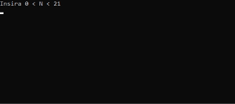

# Jogo da Forca

<p align="center">
	
</p>

## Projeto

Desafio desenvolvido durante o curso Fullstack da [Academia do Programador](https://www.academiadoprogramador.net) 2024

---
## Detalhes

O computador receberá uma sequência de comandos referentes à mensagens trocadas entre Sara e seus amigos. Cada amigo recebe uma numeração e a sequência de eventos recebida informa se a mensagem foi recebida ou enviada.

O intuito deste programa é informar o tempo que Sara demora para responder cada um dos seus amigos.

---
## Entrada

Sara deve informar a sequência de mensagens trocadas e o tempo demorado, se este for superior a 1 segundo.

---
## Funcionalidades

- __Número de eventos__: A primeira linha fornecida deve informar o número de mensagens trocadas entre Sara e seus amigos;
- __Natureza dos eventos__: Cada informação fornecida ao programa deve iniciar com as letras "R", "E" ou "T", indicando que a mensagem foi recebida, enviada ou qual o tempo de demora entre um evento e outro, respectivamente;
- __Identificação dos amigos__: Seguindo a letra que descreve a natureza do evento, deverá ser informado o amigo em questão. Para isso, cada amigo recebe uma numeração de identificação;
- __Contagem do tempo de resposta__: Sara deve responder (e apenas responder) a todas as mensagens que receber. Assim, o tempo de resposta é contado do momento que a mensagem é recebida até o momento em que Sara a responde. Considerando que Sara, por padrão, demora 1 segundo para realizar uma interação, o tempo é contado linearmente, a não ser que Sara demore mais que o normal (neste caso, ela deve informar quanto tempo demorou);
- __Mensagens sem resposta__: A vida é corrida e nem sempre Sara consegue responder à todos os seus amigos. Porém, para não ser injusta, ela atribui um tempo total negativo, para cada amigo que ficou sem resposta;
- __Ranking de tempos de resposta__: Ao receber todos os eventos informados, o computador organiza os amigos de Sara em ordem crescente, de acordo com as suas identificações, e soma os tempos de resposta respectivos a cada amigo. Ao final, o computador informa todos os amigos em contato com Sara e o tempo que Sara demora para responder cada um deles;

---
## Requisitos

- .NET SDK (recomendado .NET 8.0 ou superior) para compilação e execução do projeto.
---
## Como Usar

#### Clone o Repositório
```
git clone https://github.com/chayannerech/TempoResposta
```

#### Navegue até a pasta raiz da solução
```
cd TempoResposta
```

#### Restaure as dependências
```
dotnet restore
```

#### Navegue até a pasta do projeto
```
cd TempoResposta.ConsoleApp
```

#### Execute o projeto
```
dotnet run
```